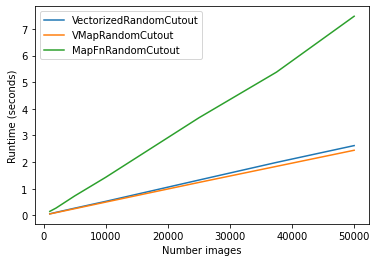

# API Design Guidelines
In general, KerasCV abides to the
 [API design guidelines of Keras](https://github.com/keras-team/governance/blob/master/keras_api_design_guidelines.md).

There are a few API guidelines that apply only to KerasCV.  These are discussed
in this document.

# Label Names
When working with `bounding_box` and `segmentation_map` labels the 
abbreviations `bbox` and `segm` are often used.  In KerasCV, we will *not* be 
using these abbreviations.  This is done to ensure full consistency in our 
naming convention.  While the team is fond of the abbreviation `bbox`, we are 
loss fond of `segm`.  In order to ensure full consistency, we have decided to
use the full names for label types in our code base.

# Preprocessing Layers
## BaseImageAugmentationLayer
When implementing preprocessing, we encourage users to subclass the 
`tf.keras.__internal__.layers.BaseImageAugmentationLayer`.  This layer provides
 a common `call()` method, auto vectorization, and more.  

When subclassing `BaseImageAugmentationLayer`, several methods can overridden:

- `BaseImageAugmentationLayer.augment_image()` must be overridden
- `augment_label()` allows updates to be made to labels
- `augment_bounding_box()` allows updates to bounding boxes to be made

When a canonical layer subclassing BaseImageAugmentationLayer is available, a 
link to it will be added here.

## Vectorization
`BaseImageAugmentationLayer` requires you to implement augmentations in an 
image-wise basis instead of using a vectorized approach.  This design choice 
was based made on the  results found in the 
[vectorization\_strategy\_benchmark.py](../benchmarks/vectorization_strategy_benchmark.py) 
benchmark.

In short, the benchmark shows that making use of `tf.vectorized_map()` performs
almost identically to a manually vectorized implementation.  As such, we have 
decided to rely on `tf.vectorized_map()` for performance.

## Color Based Preprocessing Layers
Some preprocessing layers in KerasCV perform color based transformations.  This
includes `RandomBrightness`, `Equalize`, `Solarization`, and more.  
Preprocessing layers that perform color based transformations make the 
following assumptions:

- these layers must accept a `value_range`, which is a tuple of numbers.
- `value_range` must default to `(0, 255)`
- input images may be of any `dtype`

The decision to support inputs of any `dtype` is made based on the nuance that
some Keras layers cast user inputs without the user knowing.  For example, if
`Solarization` expected user inputs to be of type `int`, and a custom layer
was accidentally casting inputs to `float32`, it would be a bad user experience
to raise an error asserting that all inputs must be of type `int`.  

New preprocessing layers should be consistent with these decisions.
